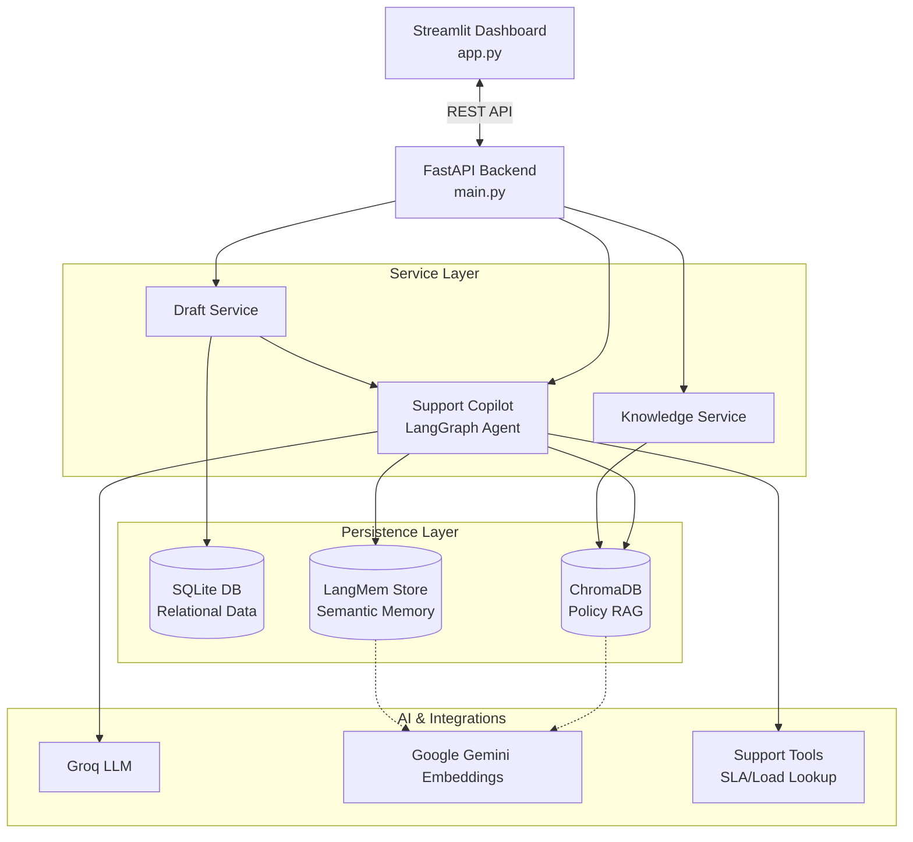
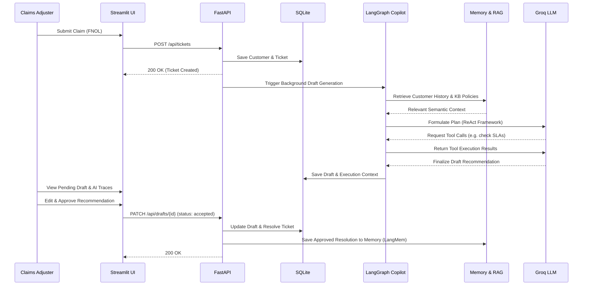

# 🛡️ Insurance Claim Support AI Agent

[](https://www.python.org/downloads/release/python-3120/)
[](https://fastapi.tiangolo.com)
[](https://streamlit.io)
[](https://opensource.org/licenses/MIT)

An enterprise-grade, AI-assisted claims operations workspace designed for insurance support teams and adjusters. This system combines a robust FastAPI backend, an intuitive Streamlit workbench, and advanced Agentic AI workflows to drastically reduce claim processing time while ensuring accurate, policy-compliant, and context-aware responses.

The architecture emphasizes a **human-in-the-loop** approach: the AI acts as a high-powered copilot to retrieve context and generate drafts, but licensed professionals retain final decision-making authority.

---

## 🌟 Key Features

* **Copilot-Assisted FNOL Intake:** Streamlines the First Notice of Loss (FNOL) process with automated background draft generation based on claim details.
* **Intelligent Draft Generation (Agentic AI):** Powered by LangGraph and Groq LLM, the agent utilizes a ReAct framework to reason over claim data, invoking necessary support tools (like SLA and workload lookups).
* **Context-Aware RAG Engine:** Uses ChromaDB and Google Gemini embeddings to query policy documents, regulation manuals, and internal guidelines instantly.
* **Persistent Customer Memory:** Leverages LangMem to store and retrieve historical claimant interactions and approved resolutions, ensuring consistent context across multiple claims.
* **Human-in-the-loop Review:** A Streamlit workbench allows adjusters to probe claim history, review AI tool execution traces, and approve or discard AI-generated recommendations.
* **Production-Ready Deployment:** Includes Docker and `docker-compose` setup alongside GitHub Actions workflows for automated testing and EC2 deployment.

---

## 🏗️ System Architecture

The project is built on a modular, multi-layer architecture to ensure clear separation of concerns, scalability, and maintainability.



### Components
* **Frontend:** Streamlit (`app.py`) serves as the adjuster workbench.
* **API Gateway/Backend:** FastAPI handles robust routing, validation (Pydantic), and lifecycle management.
* **Data Stores:** 
  * **SQLite:** Relational source of truth for Customers, Tickets, and Drafts.
  * **ChromaDB:** Local vector database for knowledge base documents.
  * **InMemoryStore/LangMem:** Semantic memory store for customer claim history.

---

## 🔄 Architecture Flow: Claim Processing & Draft Generation

This sequence details the end-to-end lifecycle of a claim registration, background AI processing, and human approval.



---

## 🛠️ Technology Stack

| Category | Technology |
| :--- | :--- |
| **Language** | Python 3.12+ |
| **API Framework** | FastAPI, Uvicorn |
| **Frontend UI** | Streamlit |
| **AI Agent Runtime**| LangGraph, LangChain |
| **LLM Inference** | Groq (`llama-3.1-8b-instant`) |
| **Vector DB / RAG**| ChromaDB |
| **Embeddings** | Google Gemini (`gemini-embedding-001`) |
| **Semantic Memory** | LangMem (backed by InMemoryStore) |
| **Relational DB** | SQLite |
| **Config Mgmt** | `pydantic-settings` |
| **Dependency Mgmt** | `uv` |
| **Testing/CI** | `pytest`, GitHub Actions |

---

## 🚀 Getting Started

### Prerequisites

* Python 3.12+
* `uv` package manager (`pip install uv`)
* **Groq API Key:** Required for LLM draft generation.
* **Google API Key:** Required for Gemini embeddings (semantic retrieval & memory).

### 1. Installation

Clone the repository and install dependencies using `uv`.

```bash
# Install backend dependencies
uv sync

# Install frontend (Streamlit dashboard) dependencies
uv sync --extra dashboard
```

### 2. Environment Configuration

Create a `.env` file in the project root:

```env
# AI Providers
GROQ_API_KEY=your_groq_api_key_here
GOOGLE_API_KEY=your_google_api_key_here

# Model Settings
GROQ_MODEL=llama-3.1-8b-instant
LLM_TEMPERATURE=0.2

# Server Configuration
API_HOST=0.0.0.0
API_PORT=8000
```

### 3. Running the Application locally

**Start the FastAPI Backend:**
```bash
uv run python main.py
```
*API available at `http://localhost:8000`*
*Interactive API documentation (Swagger) at `http://localhost:8000/docs`*

**Start the Streamlit Workbench:**
Open a new terminal session:
```bash
uv run streamlit run app.py
```
*Dashboard available at `http://localhost:8501`*

---

## 📚 Knowledge Base Ingestion

The system relies on local markdown documents stored in the `knowledge_base/` directory to ground the AI's recommendations in actual company policy.

To ingest/index these documents into ChromaDB, you can either:
1. Click **Ingest Policy & Regulation KB** in the Streamlit sidebar.
2. Hit the API endpoint directly:

```bash
curl -X POST "http://localhost:8000/api/knowledge/ingest" \
     -H "Content-Type: application/json" \
     -d '{"clear_existing": false}'
```

---

## 🐳 Docker Deployment

The project is fully containerized for production parity.

```bash
# Build and run using Docker Compose
docker-compose up -d --build

# View logs
docker-compose logs -f
```

---

## 🧪 Testing

Run the comprehensive test suite (which validates API health, draft lifecycle, and LangMem fallback behaviors):

```bash
uv run pytest
```

---

## 🌐 API Reference

### Core Endpoints

* **`GET /health`**: Health check.
* **`POST /api/tickets`**: Register a new claim/ticket and trigger background AI draft generation.
* **`GET /api/tickets/{ticket_id}`**: Retrieve ticket details.
* **`GET /api/tickets/{ticket_id}/drafts/latest`**: Fetch the most recent AI draft and execution context for a ticket.
* **`PATCH /api/drafts/{draft_id}`**: Approve, edit, or discard an AI recommendation. Approving saves the decision to semantic memory.
* **`POST /api/knowledge/ingest`**: Process and embed markdown knowledge documents.
* **`GET /api/customers/{customer_id}/memory-search`**: Search a customer's semantic claim history.

---

## 📄 License

This project is licensed under the MIT License. See the [LICENSE](LICENSE) file for details.
