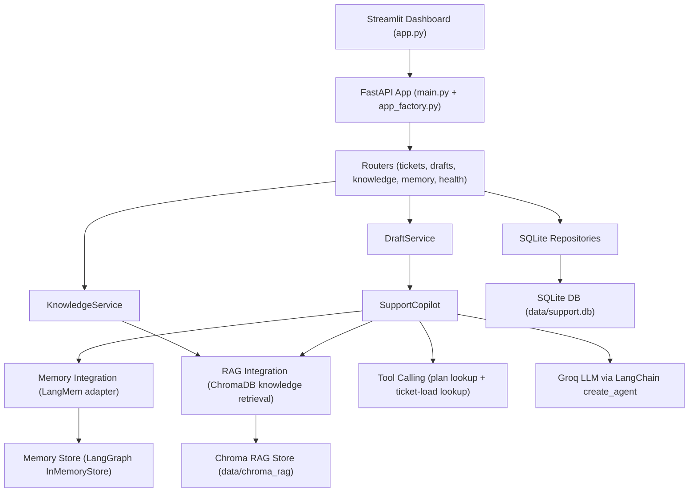

# Insurance Claim Support AI Agent

An AI-powered copilot for insurance customer support teams. It assists human adjusters by automatically generating coverage recommendation drafts grounded in policy documents, customer history, and real-time operational context — keeping the adjuster in full control of every final decision.

---

## What It Does

When a customer submits an insurance claim, the copilot:

1. **Looks up the customer** — retrieves their profile, open ticket count, and service plan tier
2. **Searches the knowledge base** — finds relevant policy rules, FAQs, and claim procedures via RAG
3. **Recalls past interactions** — uses long-term memory (LangMem) to surface context from previous conversations
4. **Drafts a reply** — generates a structured recommendation the human adjuster can review, edit, and approve

On approval, the accepted resolution is stored back into memory so the agent learns from every resolved claim.

---

## Architecture



### Runtime Request Flow

1. Adjuster creates or selects a claim (FNOL) in the Streamlit UI
2. UI calls FastAPI routes
3. Claim and customer data is read/written through SQLite repositories
4. Recommendation generation route calls `SupportCopilot`
5. `SupportCopilot` retrieves:
   - Customer/company memories (LangMem)
   - Relevant KB chunks (ChromaDB RAG)
   - Tool outputs (plan tier + open-ticket load)
6. Agent runtime (`create_agent`) generates a recommendation draft + structured context metadata
7. Draft is persisted to the `drafts` table
8. On adjuster approval, ticket status → `resolved` and the resolution is saved to memory

---

## Tech Stack

| Layer | Technology |
|-------|-----------|
| Language | Python 3.12 |
| LLM | Groq — `qwen/qwen3-32b` |
| Agent Framework | LangGraph + LangChain |
| Long-term Memory | LangMem + LangGraph `InMemoryStore` |
| Vector Store (RAG) | ChromaDB (persistent) |
| Embeddings | Google Gemini `gemini-embedding-001` |
| Text Splitting | `langchain-text-splitters` |
| Database | SQLite |
| Schema Validation | Pydantic v2 + pydantic-settings |
| API | FastAPI + Uvicorn *(planned)* |
| Dashboard | Streamlit *(planned)* |
| Package Manager | `uv` |
| Containerization | Docker + Docker Compose *(planned)* |
| CI/CD | GitHub Actions → AWS EC2 *(planned)* |

---

## Project Structure

```
Insurance-Claim-Support-AI-Agent/
├── main.py                              # FastAPI app bootstrap (planned)
├── app.py                               # Streamlit dashboard (planned)
├── pyproject.toml                       # uv project config + dependencies
├── .env                                 # Local secrets (never commit real keys)
│
├── customer_support_agent/
│   ├── core/
│   │   └── settings.py                  # Pydantic-settings configuration
│   ├── schemas/
│   │   └── api.py                       # Pydantic v2 request/response models
│   ├── repositories/
│   │   └── sqlite/
│   │       ├── base.py                  # DB init + connection management
│   │       ├── customer.py              # CustomersRepository
│   │       ├── tickets.py               # TicketsRepository
│   │       └── draft.py                 # DraftsRepository
│   ├── integration/
│   │   ├── rag/
│   │   │   └── chroma_kb.py             # ChromaDB RAG ingestion + search
│   │   ├── tools/
│   │   │   └── support_tools.py         # LangChain tool definitions
│   │   └── memory/                      # LangMem adapter (planned)
│   ├── services/                        # Copilot + draft orchestration (planned)
│   └── api/                             # FastAPI app factory + routers (planned)
│
├── knowledge_base/                      # Insurance policy markdown documents
│   ├── insurance-auto-claim-procedures.md
│   ├── insurance-auto-coverage-rules.md
│   ├── insurance-auto-faq.md
│   ├── insurance-auto-fraud-indicators.md
│   └── insurance-auto-total-loss-rules.md
│
├── notebooks/
│   ├── main.py                          # Working LangMem + LangGraph prototype
│   └── experiments.ipynb                # Memory and agent experiments
│
├── data/
│   ├── support.db                       # SQLite database
│   ├── chroma_rag/                      # ChromaDB RAG persistence
│   └── chroma_mem0/                     # ChromaDB memory persistence
│
├── docs/
│   ├── Project_Master_Documentation.md
│   ├── Customer_Support_Agent_Project_Report.md
│   └── EC2_deployment_flow.md
│
└── tests/                               # Test suite (planned)
```

---

## Prerequisites

- Python 3.12+
- [`uv`](https://docs.astral.sh/uv/) package manager
- Groq API key — [console.groq.com](https://console.groq.com)
- Google API key (for Gemini embeddings) — [console.cloud.google.com](https://console.cloud.google.com)

---

## Quick Start

### 1. Clone the repository

```bash
git clone https://github.com/Vishalkumarjaiswal16/Insurance-Claim-Support-AI-Agent.git
cd Insurance-Claim-Support-AI-Agent
```

### 2. Install dependencies

```bash
uv sync
```

### 3. Configure environment

Copy the example env file and fill in your API keys:

```bash
cp .env.example .env
```

```env
# .env
GROQ_API_KEY=your_groq_api_key_here
GOOGLE_API_KEY=your_google_api_key_here

# Optional overrides
LLM_MODEL=llama-3.1-8b-instant
GOOGLE_EMBEDDING_MODEL=gemini-embedding-001
```

### 4. Ingest the knowledge base

```bash
uv run python -c "
from customer_support_agent.integration.rag.chroma_kb import KnowledgeBaseService
from customer_support_agent.core import get_settings
svc = KnowledgeBaseService(get_settings())
result = svc.ingest_directory()
print(result)
"
```

### 5. Run the prototype agent

```bash
uv run python notebooks/main.py
```

---

## Configuration Reference

All configuration is managed via `customer_support_agent/core/settings.py` using `pydantic-settings`. Values can be set in `.env` or as environment variables.

| Variable | Default | Description |
|----------|---------|-------------|
| `GROQ_API_KEY` | — | Groq API key (required) |
| `GOOGLE_API_KEY` | — | Google API key for embeddings (required) |
| `LLM_MODEL` | `llama-3.1-8b-instant` | Groq model ID |
| `GOOGLE_EMBEDDING_MODEL` | `gemini-embedding-001` | Embedding model |
| `DATA_DIR` | `data/` | Directory for DB and vector stores |
| `KNOWLEDGE_BASE_DIR` | `knowledge_base/` | Source documents for RAG |
| `RAG_TOP_K` | `5` | Number of KB chunks to retrieve |
| `CHUNK_SIZE` | `800` | Token size per document chunk |
| `CHUNK_OVERLAP` | `100` | Overlap between chunks |
| `DASHBOARD_PORT` | `8501` | Streamlit dashboard port |
| `API_PORT` | `8000` | FastAPI server port |

---

## API Endpoints

> **Note:** The FastAPI layer is planned. The schemas and data layer are fully implemented.

### Health

| Method | Path | Description |
|--------|------|-------------|
| `GET` | `/health` | Health probe — returns `{"status": "ok"}` |

### Tickets

| Method | Path | Description |
|--------|------|-------------|
| `POST` | `/api/tickets` | Create a ticket (+ customer upsert), optional auto-draft |
| `GET` | `/api/tickets` | List all tickets |
| `GET` | `/api/tickets/{ticket_id}` | Fetch a single ticket |
| `POST` | `/api/tickets/{ticket_id}/generate-draft` | Manually trigger draft generation |

**Create ticket request body:**

```json
{
  "customer_email": "claimant@example.com",
  "customer_name": "Jane Doe",
  "customer_company": "Acme Corp",
  "subject": "Stolen vehicle claim - policy #A12345",
  "description": "My vehicle was stolen from the parking lot on April 18th...",
  "priority": "high",
  "auto_generate": true
}
```

### Drafts

| Method | Path | Description |
|--------|------|-------------|
| `GET` | `/api/drafts/{ticket_id}` | Fetch latest draft for a ticket |
| `PATCH` | `/api/drafts/{draft_id}` | Update draft content or status |

**Draft status values:** `pending` → `accepted` or `discarded`

On `accepted`: ticket status is set to `resolved` and the resolution is persisted to memory.

### Knowledge Base

| Method | Path | Description |
|--------|------|-------------|
| `POST` | `/api/knowledge/ingest` | Ingest `knowledge_base/` files into ChromaDB |

```json
{ "clear_existing": false }
```

### Memory

| Method | Path | Description |
|--------|------|-------------|
| `GET` | `/api/customers/{customer_id}/memories` | List customer + company memories |
| `GET` | `/api/customers/{customer_id}/memory-search` | Semantic memory search (`?query=...&limit=5`) |

---

## Core Modules

### `repositories/sqlite/`

Three repository classes over a shared SQLite connection manager:

- **`CustomersRepository`** — `create_or_get(email, name, company)` — idempotent upsert with race condition handling
- **`TicketsRepository`** — full CRUD, status transitions, open-ticket count per customer
- **`DraftsRepository`** — draft lifecycle (create, update, get-latest, get-with-context JOIN)

All repositories use context-manager connections with `PRAGMA foreign_keys = ON` and `PRAGMA busy_timeout = 5000`.

### `integration/rag/chroma_kb.py`

`KnowledgeBaseService` wraps a `chromadb.PersistentClient`:

- **Ingestion** — reads `.md`/`.txt` from `knowledge_base/`, splits with `RecursiveCharacterTextSplitter`, upserts chunks with SHA-1 deduplication IDs
- **Search** — returns top-k chunks with source file and distance score

### `integration/tools/support_tools.py`

Two LangChain tools exposed to the agent runtime via `get_support_tools()`:

- **`lookup_customer_plan`** — returns the customer's plan tier, SLA, and priority queue
- **`lookup_open_ticket_load`** — queries SQLite for open ticket count and returns a load band (`low / medium / high`)

### `schemas/api.py`

Full Pydantic v2 schema set including `TicketCreateRequest`, `TicketResponse`, `DraftResponse`, `StructuredDraftContext` (with version field for schema evolution), `DraftSignals`, `DraftHighlights`, and `DraftToolCall`.

---

## Streamlit Dashboard (Planned)

The dashboard (`app.py`) will provide four panels:

| Panel | Purpose |
|-------|---------|
| **Claim Registration** | Submit new FNOL with customer info, description, priority, auto-generate toggle |
| **Claim Operations** | Browse tickets, trigger recommendation generation |
| **Draft Review** | Edit AI draft, approve or request more info, view context transparency (memory hits, KB chunks, tool calls) |
| **Claim History Probe** | Run semantic search over customer memory |

---

## Deployment

### Docker (Planned)

```bash
docker compose up -d --build
```

| Service | Port |
|---------|------|
| FastAPI API | `8000` |
| Streamlit Dashboard | `8501` |

### AWS EC2 (Planned)

CI/CD via GitHub Actions:

- **CI** — runs on every PR and non-main branch push: `uv sync --dev` → `pytest`
- **CD** — triggers on push to `main`: packages app, `scp` to EC2, `docker compose up --build`, health check

Required GitHub secrets: `EC2_HOST`, `EC2_USER`, `EC2_SSH_KEY`

See `docs/EC2_deployment_flow.md` for the full deployment runbook.

---

## Implementation Status

| Component | Status |
|-----------|--------|
| Settings system | ✅ Complete |
| Pydantic schemas | ✅ Complete |
| SQLite repositories | ✅ Complete |
| ChromaDB RAG service | ✅ Complete |
| LangChain tools | ✅ Complete |
| LangMem prototype | ✅ Working (notebooks/) |
| `copilot_service.py` | 🔲 Planned |
| `draft_service.py` | 🔲 Planned |
| LangMem memory adapter | 🔲 Planned |
| FastAPI app + routers | 🔲 Planned |
| Streamlit dashboard | 🔲 Planned |
| Docker / Compose | 🔲 Planned |
| GitHub Actions CI/CD | 🔲 Planned |
| Test suite | 🔲 Planned |

---

## Knowledge Base Documents

The `knowledge_base/` directory contains the insurance policy documents indexed by the RAG system:

| File | Content |
|------|---------|
| `insurance-auto-claim-procedures.md` | Step-by-step FNOL and claims filing process |
| `insurance-auto-coverage-rules.md` | Coverage eligibility and exclusions |
| `insurance-auto-faq.md` | Common claimant questions and answers |
| `insurance-auto-fraud-indicators.md` | Fraud detection flags for adjusters |
| `insurance-auto-total-loss-rules.md` | Total loss determination criteria |

---

## License

MIT
